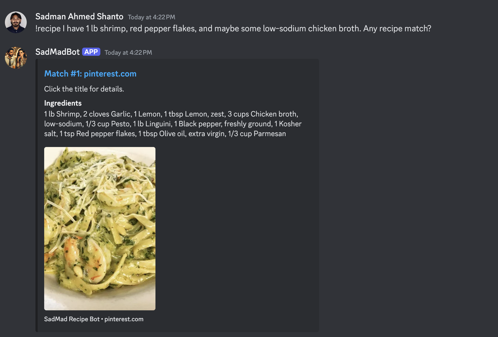
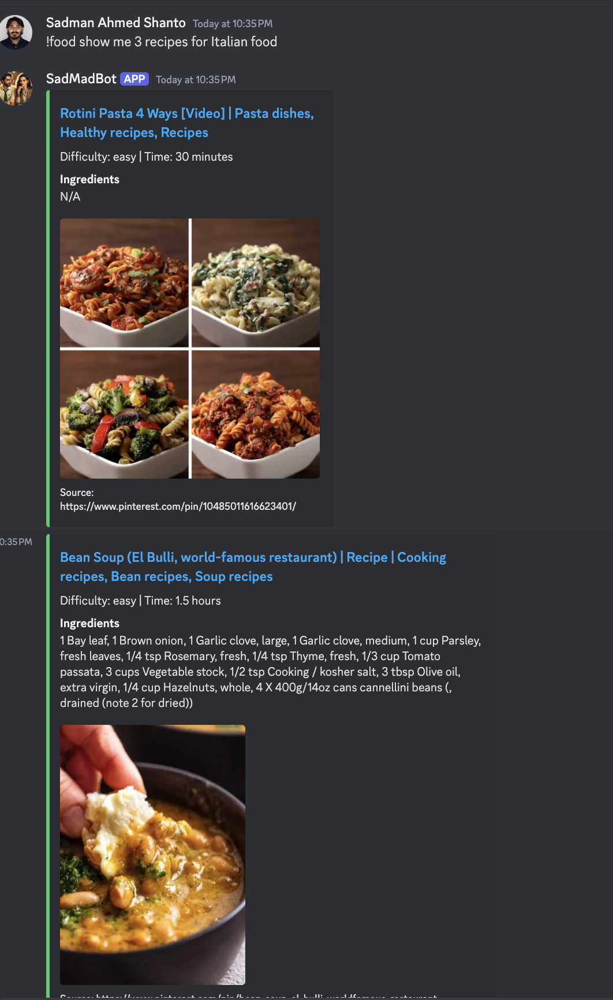
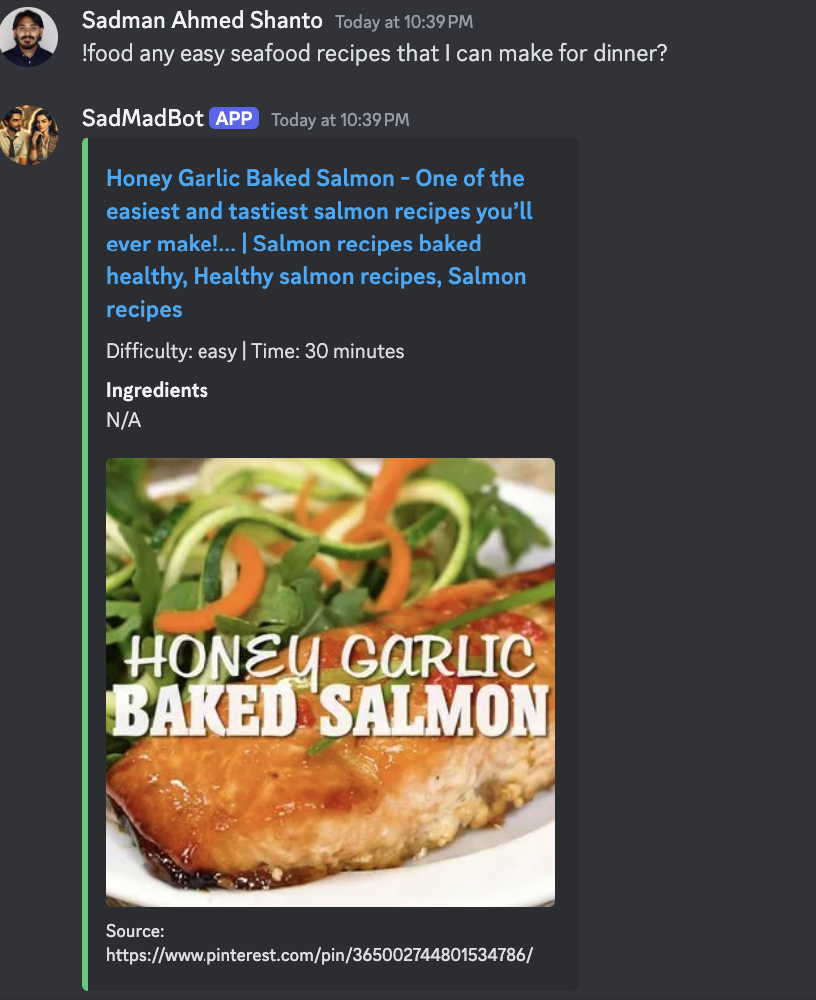
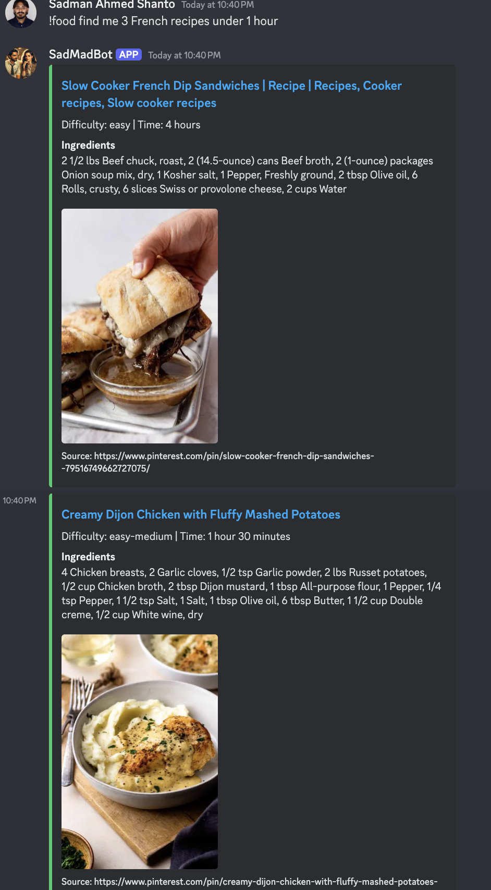
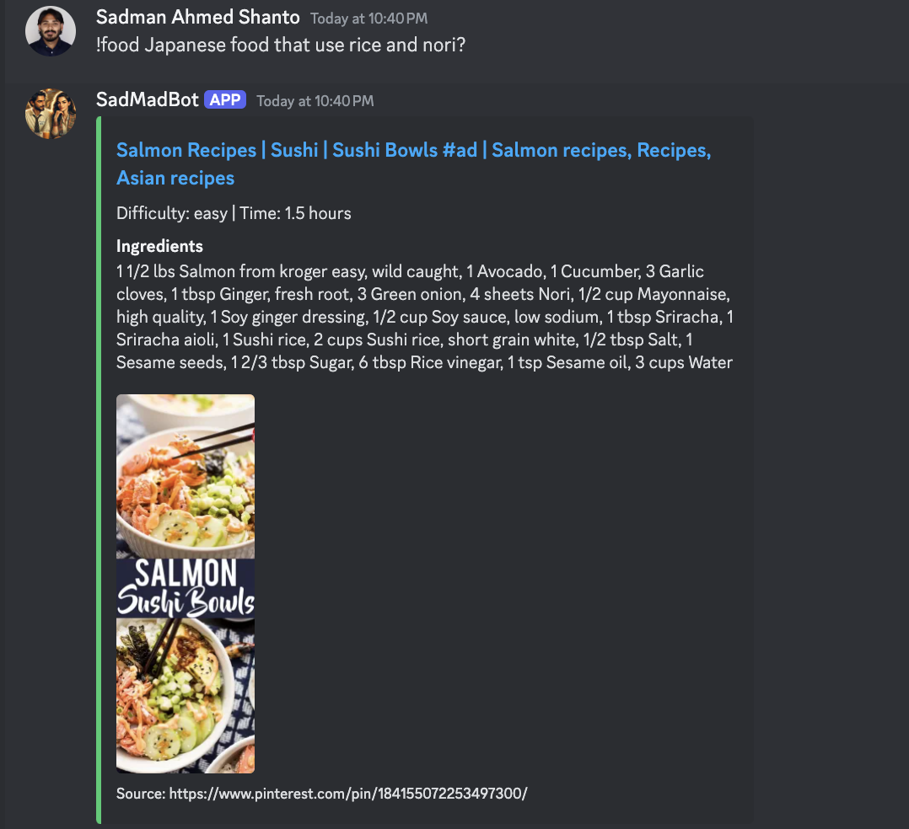

# DishCord 📍🍽️🤖: Discord Bot with Recipes from Pinterest Board

My girlfriend woke up today with the idea of being able to search for recipes based on ingredients from her [food Pinterest board](https://www.pinterest.com/madihowa/foods/). Four hours later, she got this bot that does just that.

---

## Features

1. **Pinterest Recipe Integration**

   - Fetch recipes directly from Pinterest boards.
   - Scrape titles, images, and ingredients from recipe sites.
   - Assigns cusine, difficulty, and time to each recipe.
   - Store recipes in a structured JSON format.

2. **Intelligent Ingredient Parsing**

   - Use local LLMs to interpret natural language ingredient queries (e.g., `"What can I make with shrimp and garlic?"`).
   - Includes **fuzzy search logic** to match similar or related ingredients, ensuring flexibility (e.g., `"red pepper flakes"` matches `"pepper flakes"` or `"ground pepper"`).

3. **Discord Bot Commands**

   - `!recipe <query>`: Find recipes matching your ingredients.
   - Auto-DM rules to new users.
   - `!gpt <query>`: For some general chat with the local LLM.
   - `!food <query>`: Smart search recipes using natural language, including filters like type, ingredients, difficulty, and time.

---

## Setup & Installation

### Prerequisites

1. Python 3.8+
2. Install dependencies:

   ```bash
   pip install -r requirements.txt
   ```

3. ChromeDriver installed (compatible with your Chrome version).

4. Set up `.env`:
   ```plaintext
   DISCORD_BOT_TOKEN=your_discord_token
   PINTEREST_EMAIL=your_email
   PINTEREST_PASSWORD=your_password
   ```

---

## Usage

### **1. Run the Pinterest Scraper**

Fetch recipes from Pinterest boards and scrape recipe details:

```bash
python data/pinterest_scraper.py \
    --board_url https://www.pinterest.com/<your_board> \
    --driver_path /path/to/chromedriver \
    --scroll_count 100 \
    --workers 5 \
    --output_file recipes.json
```

**Output:** `recipes.json` with structured recipe data.

---

### **2. Assign more features to the recipe**

Assign features like cuisine, difficulty, etc, to the recipes:

```bash
python data/process_data.py \
    --input_file recipes.json \
    --output_file recipes.json
```

**Output:** `recipes.json` with this new data added to each recipe.

### **3. Start the Discord Bot**

Launch the bot to interact on Discord:

```bash
python bot.py
```

---

### **4. Discord Bot Commands**

#### `!recipe <query>`

Ask for recipes based on ingredients.
_Example:_

```
!recipe I have 1 lb shrimp, red pepper flakes, and maybe some low-sodium chicken broth. Any recipe match?
```

**Bot Response (Example):**


---

#### `!food <query>`

Search recipes intelligently using natural language.

_Examples:_

1. **By type of food:**

   ```
   !food show me 3 recipes for Italian food
   ```

**Bot Response (Example):**


2. **Quick and easy recipes:**

   ```
   !food any easy seafood recipes that I can make for dinner?
   ```

**Bot Response (Example):**


3. **By ingredients and a condition:**

   - ```
     !food find me 3 French recipes under 1 hour
     ```

     **Bot Response (Example):**
     

   - ```
     !food Japanese food that use rice and nori?
     ```
     **Bot Response (Example):**
     

---

## License

This project is open-source and available under the [MIT License](LICENSE).

---

# To Do:

- [ ] Allow for exploratory chat features using the recipes.json knowledge base. e.g. "I want to make pasta" -> "What type of pasta?" -> "Spaghetti" -> "What sauce?" -> "Tomato" -> "Here's a recipe for Spaghetti with Tomato Sauce."

---
